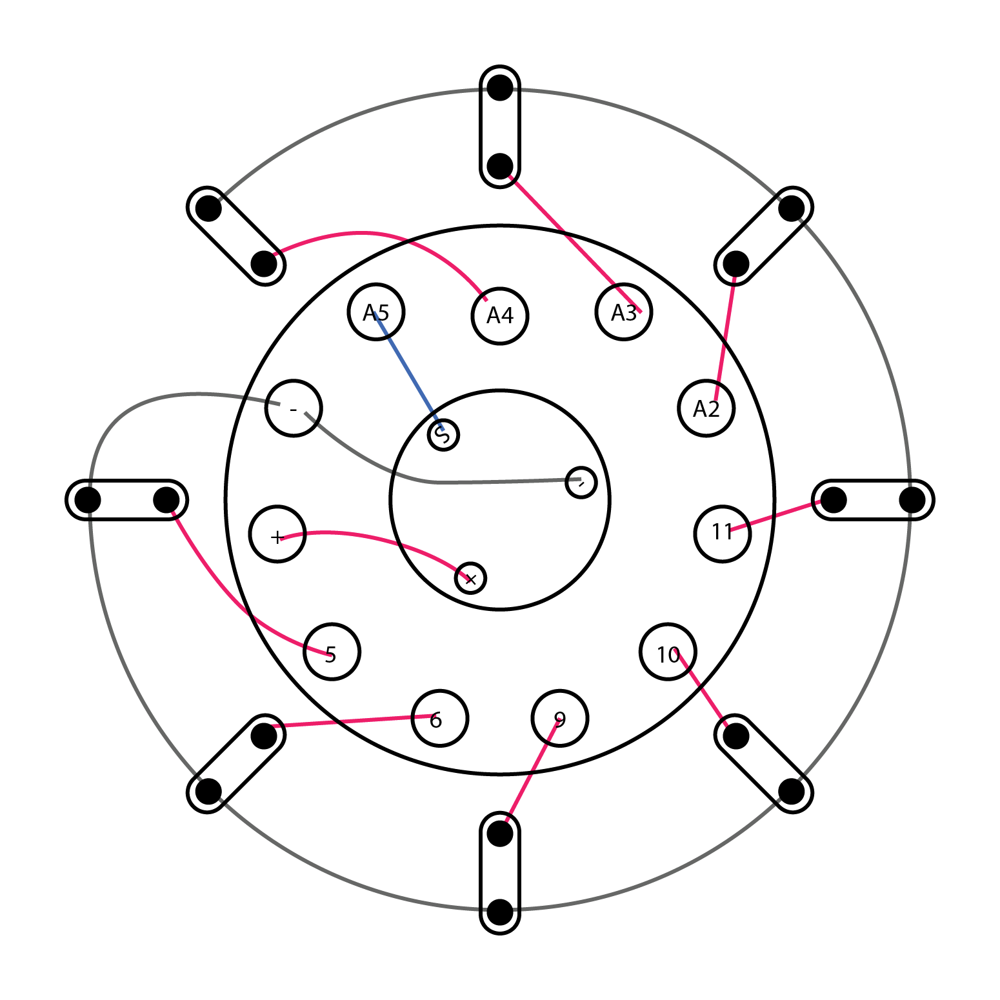

LEDCap
======

A LilyPad Project to blink sewed LEDs on a cap.

Parts
-----

- [LilyPad Arduino SimpleSnap]
- [LilyPad Light Sensor]
- [LilyPad LED]
- [Conductive thread]
- [Sew-on snaps] (8mm) x 11

[LilyPad Arduino SimpleSnap]: http://lilypadarduino.org/?p=289
[LilyPad Light Sensor]: http://lilypadarduino.org/?p=428
[LilyPad LED]: http://lilypadarduino.org/?p=465
[Conductive thread]: https://www.sparkfun.com/products/10118
[Sew-on snaps]: https://www.sparkfun.com/products/11347
